<!-- Banner -->

  

<h1 align="center">🚀 Crenspire Technologies</h1>

<em>Empowering ideas. Building the future.</em>

  
  
  
  

---

## 🏢 About Us

At **Crenspire Technologies**, we don’t just write code — we solve problems, design experiences, and enable businesses to scale.

- 💡 **Innovation-driven** – Exploring AI/ML, IoT, Blockchain, AR/VR
- 🎯 **Client-centric** – Partnering with companies globally
- 🛠️ **End-to-end delivery** – From idea → design → development → QA → deployment

---

## 🛠️ Our Services

- 🌐 **Web Development** (React, Node, Laravel, MERN, PHP)
- 📱 **Mobile Apps** (iOS, Android, Flutter, React Native)
- 🎨 **UI/UX & Product Design**
- ✅ **QA & Automation Testing**
- ☁️ **DevOps & Cloud** (Kubernetes, Docker, CI/CD, AWS, GCP)
- 🤖 **AI/ML Solutions**
- 🔗 **Blockchain & Web3**
- 🌍 **IoT & Embedded Systems**

---

## 💻 Tech Stack Highlights

  
  
  
  
  
  
  
  
  
  

---

## 🌟 Our Values

- 🔹 **Innovation First** – We love exploring new technologies
- 🔹 **Transparency** – Clear communication & honest feedback
- 🔹 **Quality & Scalability** – Products designed to last
- 🔹 **Global Mindset** – Serving clients across continents

---

## 📈 Achievements

- 🌍 Served clients across **5+ countries**
- 💻 Delivered **100+ projects** successfully
- 🤝 Trusted by **startups & enterprises** alike

---

## 📬 Connect With Us

🌐 Website: https://crenspire.com  
💼 LinkedIn: https://www.linkedin.com/company/crenspire-technologies/  
📸 Instagram: https://www.instagram.com/crenspire  
✉️ Email: hello@crenspire.com

---

## 🤝 Open Source & Collaboration

We believe in the power of community 🌐.  
Stay tuned as we publish tools, starter kits, and open-source contributions right here on GitHub!

---

⭐️ If you like what we do, give our repos a star and follow us for updates!

